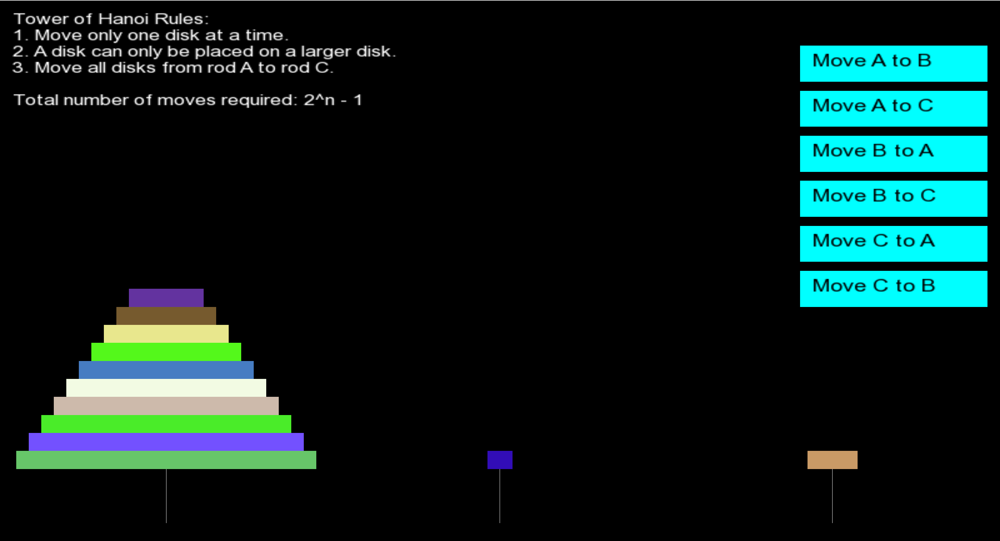

# Tower of Hanoi Game



## About the Project

We (Piyush Kurwade: [Piyush1148](https://github.com/Piyush1148), Aman Mehtar: [amanmprojects](https://github.com/amanmprojects), Aryan Koli: [Aryan2005-unq](https://github.com/Aryan2005-unq)) have created this as our Second Year Computer Graphics (CG) Course project.

## Getting Started

### Prerequisites

- Make sure you have **SFML** installed on your system. SFML is used for creating the graphical user interface.

### Installing SFML on Linux

To install SFML on a Linux distribution like Ubuntu, you can use the following commands:

```bash
sudo apt update
sudo apt install libsfml-dev
```

For other Linux distributions or Operating System installation instructions for other operating systems, visit the official [SFML website](https://www.sfml-dev.org/).

### Compilation Instructions

To compile the game, use the following command:

```bash
g++ game.cpp -o tower_of_hanoi
```

If you encounter any errors related to SFML, try the following command instead:

```bash
g++ game.cpp -o tower_of_hanoi -lsfml-graphics -lsfml-window -lsfml-system
```

### Running the Game

Once compiled, you can run the game using:

```bash
./tower_of_hanoi
```

### Additional Information

If you are using an operating system other than Linux or want to try another installation method for SFML, please visit [SFML's official website](https://www.sfml-dev.org/) for detailed instructions.

## Gameplay

The Tower of Hanoi is a mathematical puzzle where the objective is to move a stack of disks from one rod to another, following these rules:

1. Only one disk can be moved at a time.
2. A disk can only be placed on top of a larger disk.
3. All disks must end up on a different rod than where they started.

Enjoy the game!
